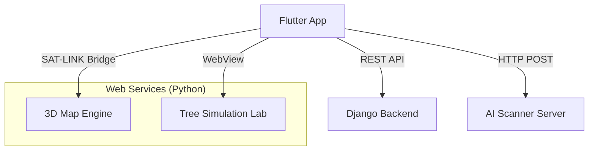

# 🌍 GeoCampus Elite Hub

GeoCampus is a serious game for campus sustainability. It integrates a Flutter mobile app with 3D maps and reforestation simulations.

---

## 🚀 Quick Start (Commands)

To start the full environment, run these in separate terminals:

### 1. Start Backends (Map, Simulation, AI)
```powershell
./run_geocampus.bat
```

### 2. Start Django Database
```powershell
cd backend/campus_sustainability
python manage.py runserver 0.0.0.0:8000
```

### 3. Run Flutter App
```powershell
cd frontend
C:\flutter\bin\flutter.bat run
```

---

## 🏗️ System Architecture
...

The project consists of four main components operating in concert:



1. **Flutter Mobile Frontend**: The core user interface, handling navigation, quests, and global audio.
2. **3D Map Engine**: A MapLibre GL based map serving as the interactive playground for campus exploration.
3. **Simulation Lab (EZ-Tree)**: A procedural generator that allows users to visualize trees they want to plant.
4. **Django Backend**: Manages user authentication, sustainability quests, and leaderboard data.
5. **AI Scanner**: A Python service for real-time specimen recognition from the mobile camera.

---

## ✨ Core Features

- **Real-time GPS Sync**: Your real-world position is projected onto a 3D model of the campus.
- **Specimen Interaction**: Tap 3D models of existing plants to view their sustainability benefits.
- **Reforestation Lab**: Procedurally generate trees and plan where they could be planted.
- **Sustainability Quests**: Complete challenges to earn points and climb the leaderboard.
- **Atmospheric Ambience**: Dynamic audio that adapts to your exploration state.

---

## 🚀 Quick Run Summary (The "GG" Manual)

If you've already set up the environment, use these commands to start the "Elite Hub":

### 1. Launch Backends (One Command)
Run the provided batch script to start the Map, Simulation, and AI servers:
```powershell
./run_geocampus.bat
```

### 2. Start Django Database
In a separate terminal:
```bash
cd backend/campus_sustainability
python manage.py runserver 8000
```

### 3. Build & Deploy
Plug in your phone (ensure it's on the same WiFi: `192.168.1.44`) and run:
```bash
cd frontend
flutter run
```

---

## 🛠️ Detailed Setup Guide

### Prerequisites
- **Flutter SDK** (Channel Stable)
- **Python 3.10+**
- **Android Phone** with Developer Mode enabled.

### 1. Backend Dependencies
Install the required Python packages for the database and AI services:
```bash
cd backend/campus_sustainability
pip install -r requirements.txt
```

### 2. Database Migration
Populate the game data:
```bash
cd backend/campus_sustainability
python manage.py makemigrations
python manage.py migrate
python manage.py loaddata games.json
python manage.py loaddata buildings.json
```

### 3. Web Assets Configuration
Ensure the `web_assets` are served correctly on port 8080. If your PC IP changes, update it in:
- `lib/screens/geocampus_map.dart`
- `lib/screens/geocampus_simulation.dart`

---

## 🛰️ Troubleshooting

- **GPS Stuck?** Ensure location permissions are granted and you have a clear view of the sky (or are near a window).
- **Blank Map?** Check that `python -m http.server 8080` is running in the `web_assets` directory.
- **IP Mismatch?** The app currently points to `192.168.1.44`. Run `ipconfig` to verify your machine's current IP.

---
**GeoCampus Elite** - *Building a greener future, one pixel at a time.*
